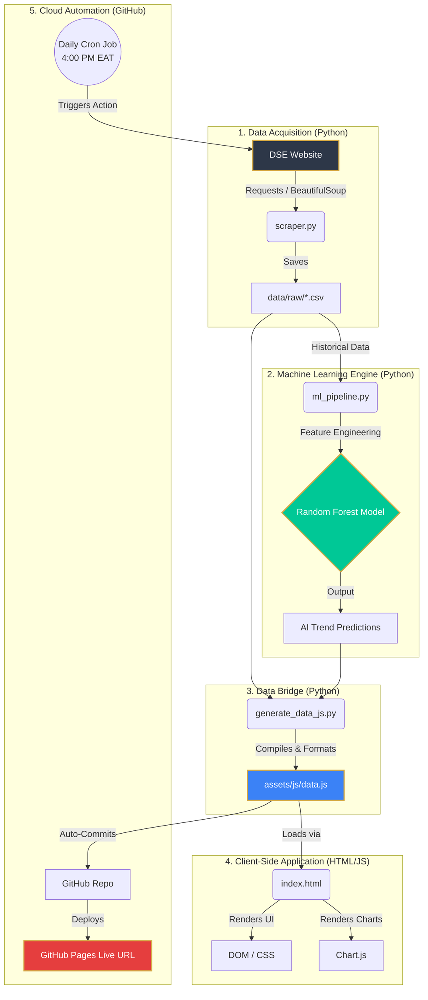

<div align="center">

# 🇹🇿 DSE Insight Dashboard
### Intelligent Investment Analytics & Predictive AI Platform

[](https://www.python.org/)
[](https://developer.mozilla.org/en-US/docs/Web/JavaScript)
[](https://github.com/features/actions)
[](https://scikit-learn.org/)
[](https://opensource.org/licenses/MIT)

**DSE Insight** is a premium, zero-cost, serverless web application that transforms raw data from the Dar es Salaam Stock Exchange (DSE) into a stunning, beginner-friendly analytics dashboard powered by Machine Learning.

[Explore the Live Dashboard](https://jemmziray-tech.github.io/dse-investment-dashboard) *(Insert your live URL here)*

---
</div>

## ✨ Key Features

- **🤖 AI Trend Predictor:** A Scikit-Learn Random Forest model analyzes historical momentum and trading volume to forecast the short-term trend (🟢 Bullish, 🔴 Bearish, ⚪ Neutral) for every listed company.
- **💎 Premium Glassmorphism UI:** A stunning, dark-themed, Tanzanian-inspired interface designed to rival professional Bloomberg terminals, built entirely in Vanilla HTML/CSS/JS.
- **🎓 Beginner-Friendly Tools:** Breaks down financial jargon with an interactive "Shares Calculator", simple "Market in Plain English" summaries, tooltips, and ⭐ Blue Chip badges to guide first-time investors.
- **🌍 Zero-Cost Serverless Automation:** The entire data pipeline (Scraping ➔ AI Inference ➔ Data Compilation ➔ Website Deployment) runs automatically every day using GitHub Actions and GitHub Pages. No servers, no databases, zero hosting costs.

---

## 🏗️ System Architecture

The project utilizes a highly efficient "Scraper-to-Static" architecture. It completely bypasses the need for an expensive backend server or database by generating a statically servable JavaScript data payload.



### Architecture Breakdown
1. **Scraper (`scraper.py`)**: Fetches the daily market reports from the DSE and saves them locally as CSV files.
2. **ML Pipeline (`ml_pipeline.py`)**: Consumes the historical CSV data, calculates momentum/volume features, and runs a Scikit-Learn Random Forest Classifier to generate confidence scores for future trends.
3. **Data Bridge (`generate_data_js.py`)**: Bridges the gap between local Python processing and the browser. It merges the latest CSV data with the ML predictions and outputs a pure JavaScript object file (`data.js`).
4. **The Frontend (`index.html` & `app.js`)**: A completely static, client-side application that reads `data.js` to render the UI, populate tables, and draw Chart.js visualizations.

---

## 🚀 Getting Started Locally

### Prerequisites
- Python 3.10+
- A modern web browser

### Installation
1. Clone the repository:
   ```bash
   git clone https://github.com/jemmziray-tech/dse-investment-dashboard.git
   cd dse-investment-dashboard
   ```
2. Create and activate a virtual environment:
   ```bash
   python -m venv .venv
   # Windows:
   .venv\Scripts\activate
   # Mac/Linux:
   source .venv/bin/activate
   ```
3. Install dependencies:
   ```bash
   pip install -r requirements.txt
   ```

### Running the Pipeline
To manually run the pipeline and update the data:
1. Run the scraper to get today's data:
   ```bash
   python scraper/scraper.py
   ```
2. Run the data bridge (which automatically triggers the ML pipeline):
   ```bash
   python generate_data_js.py
   ```
3. Open `index.html` in your browser to view the updated dashboard!

---

## ☁️ Setting Up Cloud Automation

You can set this project to scrape, predict, and host itself completely for free.

1. **Push to GitHub**: Push this repository to your GitHub account.
2. **Enable GitHub Pages**:
   - Go to your repository **Settings** > **Pages**.
   - Under "Build and deployment", set the source to **Deploy from a branch**.
   - Select the `main` (or `master`) branch.
3. **The Magic**: The included `.github/workflows/daily_scraper.yml` file is pre-configured to run every Monday-Friday at 4:00 PM EAT. It will automatically run the scraper, execute the AI model, and push the new data to your live website. 

---

## ⚠️ Disclaimer
**Educational Purposes Only.** The data presented on this dashboard and the predictions generated by the AI models do not constitute financial advice. Always consult a licensed financial advisor before making investment decisions on the Dar es Salaam Stock Exchange.

---

## 📜 License
This project is licensed under the MIT License - see the [LICENSE](LICENSE) file for details.

---
<div align="center">
<i>Built with ❤️ by <a href="https://github.com/jemmziray-tech">John Elifuraha Mziray</a></i>
</div>